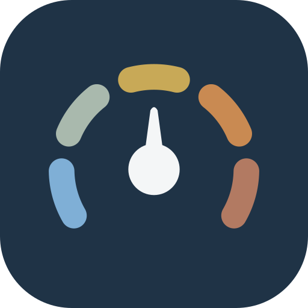
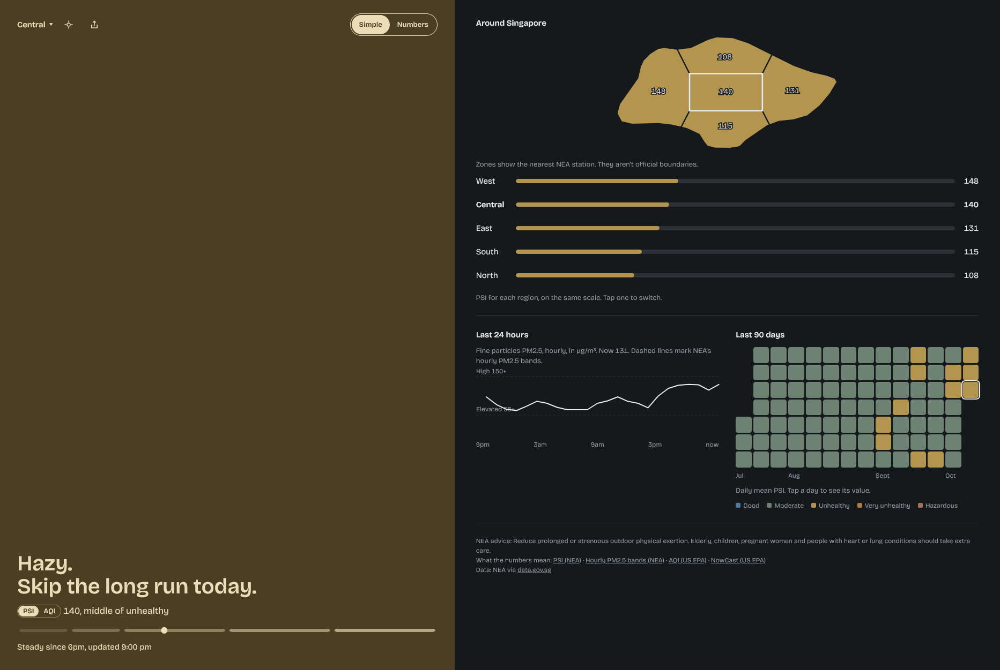

<p align="center">
  
</p>
<h1 align="center">HazeWatch</h1>

<p align="center">
  <a href="https://github.com/nicholaslimck/hazewatch/actions/workflows/docker.yml"></a>
  <a href="LICENSE"></a>
</p>

A self-hosted dashboard for Singapore's air quality. It pulls PSI and PM2.5 readings for the five regions from NEA, stores them in SQLite, and serves a small web app with current values and history.

<p align="center">
  
</p>

## Features

- Current reading for the five NEA regions, on a region map or a picker, with a plain-language verdict.
- A toggle between NEA's PSI and an AQI (US EPA scale). The AQI is calculated by the app from hourly PM2.5 using the EPA NowCast. It is not an official reading.
- A 24-hour trend and a calendar of daily history.
- A share card, and a home-screen install (PWA).
- Optional Telegram alerts when your region's air turns unhealthy.

## Quick start

```
docker compose up -d
```

Compose pulls `ghcr.io/nicholaslimck/hazewatch:latest`, which GitHub Actions builds from `main` for amd64 and arm64. To pin a release, change the tag in `compose.yaml` to a version such as `:1.2.0`. Then open http://localhost:8081 (the host port defaults to 8081; set `HOST_PORT` to change it).

The first start backfills about 90 days of history, which takes a few minutes. Data is kept in the `aq-data` Docker volume, so restarts skip days already stored.

## Configuration

All settings are environment variables. Set them in your shell or in a `.env` file next to `compose.yaml`; Compose passes them through.

| Variable | Purpose |
| --- | --- |
| `DATA_GOV_SG_API_KEY` | Optional. Raises your data.gov.sg rate limit. The app works without it. |
| `TELEGRAM_BOT_TOKEN` | Enables the Telegram bot. Without it the bot stays off. |
| `TELEGRAM_BOT_URL` | The bot's public link, for example `https://t.me/YourBot`. Shown in the app as a "Get alerts on Telegram" link. Unset, or anything that is not an absolute `http(s)` URL, hides the link. |
| `PUBLIC_URL` | The address the app is served from, for example `https://haze.example.com`. Exposed at `GET /api/config` as `{ "publicUrl": ..., "botUrl": ... }` (`null` when unset) and used as the link on the share card. |
| `HOST_PORT` | Host port the app is published on (default `8081`). The container always listens on `8080`. |
| `PORT`, `DB_PATH` | Server port (default `8080`) and SQLite path (default `./data/aq.db`). |

## Telegram alerts

The bot messages people when their region's 24h PSI turns unhealthy, changes band or clears, and never between 11pm and 7am SGT.

1. Message @BotFather, send `/newbot`, and pick a name and username (suggested: `@HazeWatchSG_bot`).
2. Set `TELEGRAM_BOT_TOKEN` to the token it gives you, and `TELEGRAM_BOT_URL` to the bot's link (for example `https://t.me/YourBot`) so the site can point people to it.
3. Restart. Message the bot `/start` (or `/region` to change it), pick a region, then try `/now`. `/scale` switches between PSI and AQI. `/stop` unsubscribes.

The bot is open to anyone who finds it. Limits: 500 subscribers, one reply per chat every 3 seconds, and it never echoes what people type.

## Local development

You need Bun and Node 22.18 or later.

```
bun install
bun run dev:server   # API on :8080
bun run dev:web      # Vite dev server, proxies /api to :8080
bun run test
bun run typecheck
bun run build        # production web build into dist/
docker build -t hazewatch .   # build the image locally
```

Layout: `server/` (Hono API, NEA ingest, SQLite, Telegram bot), `web/` (React app), `shared/` (code used by both, such as bands and AQI maths), `scripts/` (map geometry build).

## Data

Readings come from NEA via [data.gov.sg](https://data.gov.sg). The server refetches both endpoints every 15 minutes — NEA publishes each hour's reading roughly 15 minutes past the hour, so a quarter-hourly poll keeps the app within about 15 minutes of the source — and nothing is pruned: history only grows, in the `aq-data` volume.

## Not built

Forecasts, email or push alerts, user accounts, and other data sources such as WAQI.

## AI usage

This project was built with Claude Code. Claude helped write the design specs, the implementation plans, and the code and tests. The app itself makes no AI calls at runtime.

## License

See [LICENSE](LICENSE).
